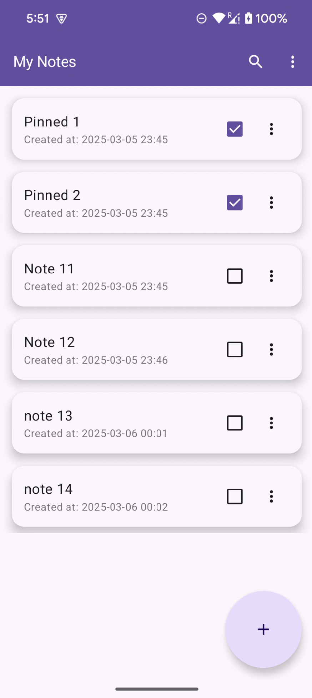
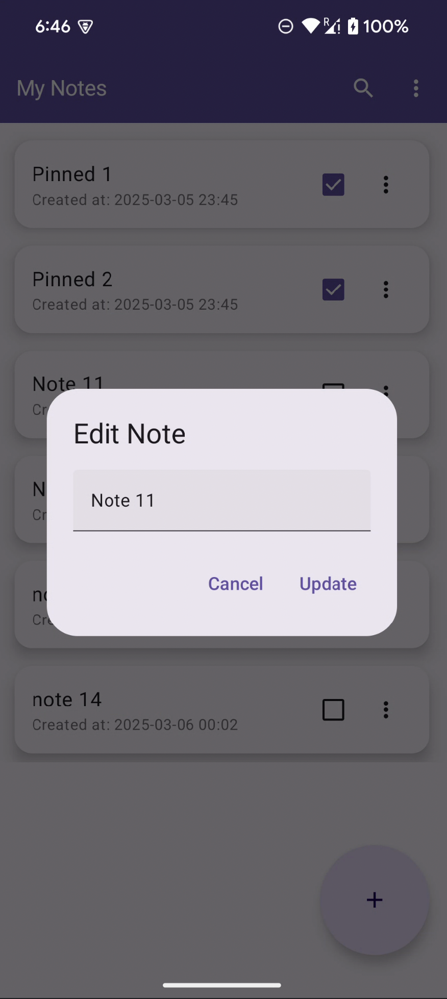
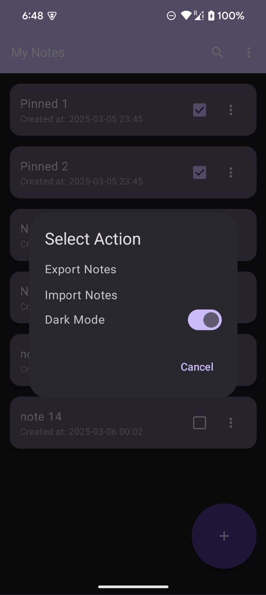
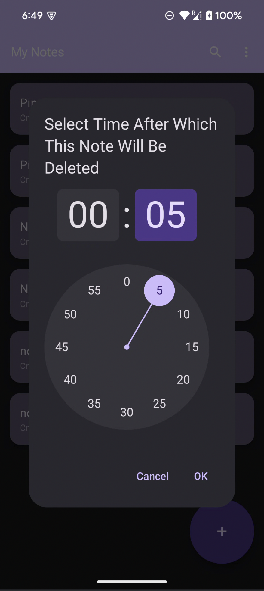
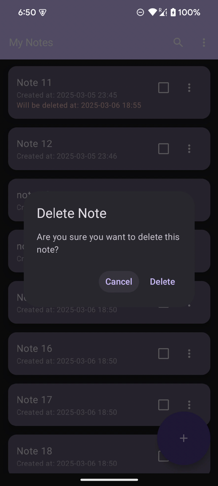
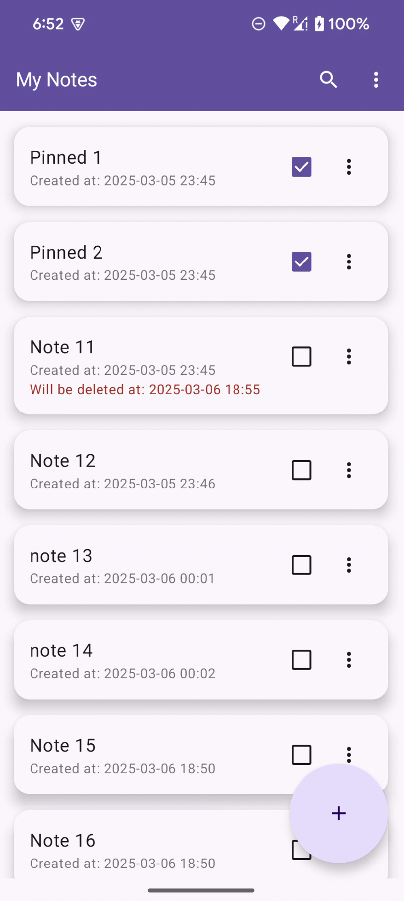

# 🔐 Encrypted Notes App
*Demo task by Danil Gahov 

**Encrypted Notes App** is your new best friend when it comes to securely managing your personal notes! 📝✨

Ever worried someone might peek at your private thoughts, sensitive ideas, or secret recipes? Fear no more! 
This app ensures your notes are encrypted, secure, and accessible only to you, 
offering peace of mind with a sprinkle of fun! 🤫🔒

---

## 🚀 Principles of Encrypted Notes App:

- **Privacy First!** All notes are encrypted with robust AES encryption using Android Keystore—so your secrets stay secret!
- **User-Friendly!** Beautiful, clean, and intuitive interface powered by Jetpack Compose for effortless note-taking.
- **Offline Ready!** No internet? No worries! Your notes are safely stored locally.
- **Quick Find!** Instantly search notes by title—no more endless scrolling.

---

## 🎯 Core Features

- ✅ **Secure Note Storage:** Safely create, edit, delete, and store notes securely with AES encryption.
- 🔍 **Search:** Quickly find notes by their titles.
- 🌙 **Offline Support:** No need for an internet connection; your notes travel with you wherever you go!

---

## 🌟 Bonus Features

- 📤📥 **Export/Import:** Easily backup or move your encrypted notes across devices.
- 🌙☀️ **Dark Mode Toggle:** Switch effortlessly between light and dark modes to match your mood.
- 📌 **Pinned Notes:** Important notes stay at the top, just like your favorite sticky notes!
- ⏳ **Self-destructing Notes:** Notes that vanish automatically after a set time—perfect for your top-secret info!

---

## 🛠 Tech Stack

- **Kotlin**
- **Jetpack Compose** 
- **MVVM with Clean Architecture**
- **Room Database**
- **Android Keystore API**
- **Coroutines & Flow**
- **Unit Tests (JUnit, MockK)**

---

## ✅ Testing

The app has robust testing coverage:
- **Encryption logic:** Ensures notes are correctly encrypted and decrypted.
- **ViewModel logic:** Guarantees stable and predictable app behavior.

---

## 🚦 How to Use

1. **Build & Install** the APK on your Android device.
2. **Open the app** and start creating your secure notes!
3. **Enjoy** peace of mind with your privacy intact! 😉

---

Made with 🔐 by Danil Gahov 😎
